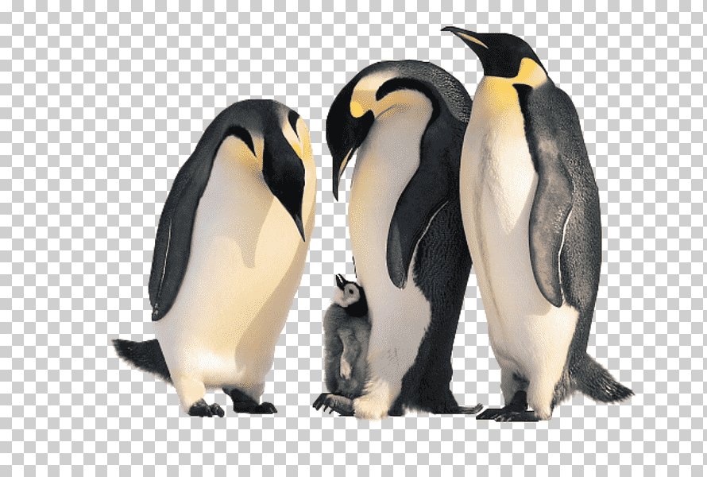

# EDA Penguins

Este repositorio se basa en un trabajo de EDA sobre el dataset de Pinguinos con unos cuantos ejercicios.

## Conjunto de datos

Este dataset se divide en 7 columas compuestas por 334 filas cada una en las que tendremos que reparar o eliminar teniendo en cuenta el numero de valores nulos de cada una.

## Objetivos

El principal objetivo no es otro que aprender y seguir cogiendo experiencia en este mundillo. Continuar con la practica con el código, ver nuevas gráficas y empezar a pensar más de vez en cuando como un analísta de datos. Dentro de este objetivo se desprenden otros más en relación con el conjunto de datos con el que trabajamos. Se desprenden estos objetivos especificos:

1. Descargar un dataset de Seaborn interesante.

2. Revisar que no tenga valores nulos.

3. Seleccionar, al menos, 5 variables (como mucho, 10), entre las que que debe haber al menos una continua y una discreta.

4. Quitar los outliers.

5. Realizar un heatmap interesante (siendo distinto del proporcionado).

6. Mostrar una de las variables continuas y su relación frente a otra variable que actúe de objetivo.

7. Mostrar una de las variables discretas y su relación frente a otra variable (la misma del 6) que actúe de objetivo.

## Resultados

Vemos como hay muy pocos nulos en cada columna, por lo que he decidido que la mejor opción ha sido el eliminarlos, asimismo he hecho con los outliers, para que se reflejen mejor los datos que quiero mostrar.

De lo que son los resultados de las variables, vemos una alta correlacion entre la longitud del pico y el peso corporal de los pingüinos dependiendo de cada isla como se ve en la grafica. Así como se ha demostrado que los pingüinos de la isla de Biscoe, son los que más masa corporal tienen.

## Código

Para ejecutar el código, primero, antes de todo, asegúrese de tener todas las dependencias instaladas.

## Contribuciones

Las contribuciones a este repositorio son bienvenidas. Asegúrese de que el código siga las mejores prácticas y esté bien documentado.

## Licencia

Este proyecto está bajo la licencia MIT.
